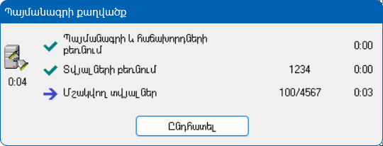

## Բովանդակություն

- [Ներածություն](#ներածություն)
- [Հատկություններ](#հատկություններ)
  - [CancellationRequest](#cancellationrequest)
  - [CurrentPhase](#currentphase)
- [Մեթոդներ](#մեթոդներ)
  - [Add](#add)
  - [Refresh](#refresh)

## Ներածություն

IExecutionProgress ինտերֆեյսը նախատեսված է [Տվյալների աղբյուրի](../definitions/document.md), [Փաստաթղթի](../definitions/document.md) և [Տվյալների մշակման հարցման (DPR)](../definitions/dpr.md) ցուցադրվող պրոգրեսի պատուհանում լրացուցիչ փուլեր ցույց տալու համար։

Տրվում է հնարավորություն ավելացնել նոր փուլ ցանկալի տեքստով, նշել քանակային ցուցանիշը։

Օրինակ՝

```c#
//DPR Execute-ի մեջ
this.Progress.Add("Պայմանագրի և հաճախորդների բեռնում".ToArmenianANSI());
//...
//data
this.Progress.Add("Տվյալների բեռնում".ToArmenianANSI());
this.Progress.CurrentPhase.Row = data.Count;
//...
//rows, մշակման համար
this.Progress.Add("Մշակվող տվյալներ".ToArmenianANSI());
this.Progress.CurrentPhase.Total = rows.Count;
this.Progress.CurrentPhase.Row = 0;
foreach (var row in rows)
{
    this.Progress.CurrentPhase.Row++;
    //մշակում
}
```



## Հատկություններ

### CancellationRequest

```c#
CancellationRequest CancellationRequest { get; }
```

Պրոգրեսի ընդհատման դեպքում այս հատկությունը ցույց է տալիս արդյոք ընդհատումը եղել է օգտագործողի կողմից, թե ադմինիստրատիվ գործիքի միջոցով։

**Օրինակ**

```c#
//DPR Execute-ի մեջ
if (cancellationToken.IsCancellationRequested)
{
    if (this.Progress.CancellationRequest.IsForced)
    {
        // Ընդհատումը տեղի է ունեցել ադմինիստրատիվ գործիքի միջոցով
        // Ընտհատման հաղորդագրությունը հասանելի է this.Progress.CancellationRequest.Message-ի մեջ
    }
    break;
}
```

### CurrentPhase

```c#
ProgressPhase CurrentPhase { get; set; }
```

Վերադարձնում է պրոգրեսի պատուհանում ընթացիկ փուլի տվյալները և թույլ է տալիս դրանք փոփոխել։

## Մեթոդներ

### Add

```c#
void Add(string name)
```

Պրոգրեսի պատուհանում ավելացնում է նոր փուլ։

**Պարամետրեր**

* `name` - Նոր փուլի տեքստը՝ հայերեն ANSI կոդավորմամբ, կամ անգլերեն։

### Refresh

```c#
void Refresh(string name)
```

Պրոգրեսի պատուհանում փոխում է ընթացիկ փուլի տեքստը։

**Պարամետրեր**

* `name` - Ընթացիկ փուլի նոր տեքստը՝ հայերեն ANSI կոդավորմամբ, կամ անգլերեն։
