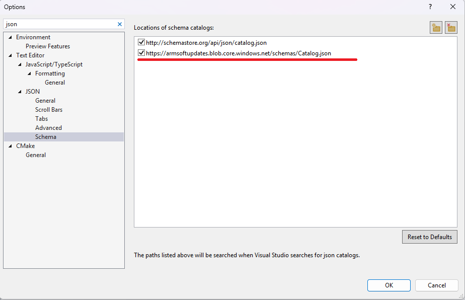

## Բովանդակություն

- [Ինչ է Api Client-ը](#ինչ-է-api-client-ը)
- [Api Client-ի ստեղծում](#api-client-ի-ստեղծում)
- [Մանիֆեստ](#մանիֆեստ)
- [Մանիֆեստի դաշտերի նկարագրություն](#մանիֆեստի-դաշտերի-նկարագրություն)
- [Մանիֆեստի օրինակ](#մանիֆեստի-օրինակ)
- [Մանիֆեստի ներմուծում](#մանիֆեստի-ներմուծում)
- [Մանիֆեստի արտահանում](#մանիֆեստի-արտահանում)

## Ինչ է Api Client-ը

8X սերվիսին որևէ ծրագրից միանալու համար անհրաժեշտ է նախապես սահմանել մուտք գործելու տվյալները բանալիով (գաղտնիքով)։
Այդ տվյալները կոչվում են Api Client։

Առկա է սահմանված մուտք գործելու երեք եղանակ։
1. Ինտեգրացիոն ծրագրի և գաղտնի բանալու սահմանում ՀԾ-Բանկում։
2. Օգտագործողի սահմանում ՀԾ-Բանկում (SQL նույնականացում), և գաղտնագրման սերտիֆիկատի սահմանում։
  Սերտիֆիկատը օգտագործվում է կապուղին գաղտնագրման համար։
3. Օգտագործողի սահմանում ՀԾ-Բանկում և Active Directory-ում, և գաղտնագրման սերտիֆիկատի սահմանում։
  Սերտիֆիկատը օգտագործվում է կապուղին գաղտնագրման համար։  
  Այս տարբերակը գործում է դեռևս միայն 4X UI ծրագրերի միջից։

## Api Client-ի ստեղծում

Այն անհրաժեշտ է ստեղծել 4X կամ 8X համակարգում **Ադմինիստրատորի ԱՇՏ**-ի **API Client-ներ** դիտելու ձևի **Ավելացնել** կոնտեքստային ֆունկցիայով, նշելով`
* Կլիենտի անվանումը (առավելագույնը 50 նիշ)։
* Json ֆորմատի [Մանիֆեստ](#Մանիֆեստ) ֆայլ, որը սահմանում է կլիենտ ծրագրի իրավասությունները և սահմանափակումները։
* Կլիենտի վավերականացման եղանակը՝ սերտիֆիկատով կամ բանալիով։  
  **Սերտիֆիկատով** նշիչը ընտրելու դեպքում անհրաժեշտ է նշել **Սերտիֆիկատի ճանապարհը**, հակառակ դեպքում **Բանալի** դաշտում գեներացնել նոր բանալի։
* Կլիենտը ակտիվ է, թե ոչ։
* Կլիենտը հարցումները կատարելուց օգտագործում է յունիկոդ կոդավորում, թե Ansi կոդավորում:


## Մանիֆեստ 

**Մանիֆեստ**-ը json ընդլայնմամբ ֆայլ է, որը պարունակում է կլիենտ ծրագրի իրավասություններն ու սահմանափակումները՝ 
* որ օգտագործողները կարող են մուտք գործել համակարգ, 
* ինչ տվյալների աղբյուրների, փաստաթղթերի և DPR-ների կարող են դիմել,
* ինչ API կանչեր կարող են կատարվել։

**Մանիֆեստ** ֆայլի կառուցվածքը նկարագրված է JSON Schema-ով, որը հասանելի է https://armsoftupdates.blob.core.windows.net/schemas/ClientManifestJsonSchema.json հասցեով։

JSON Schema-ն օգտագործելու համար անհրաժեշտ է՝
* բացել Visual Studio-ի **Tools** մենյուի **Options** պատուհանը,
* պատուհանի **Json -> Schema** բաժնում ավելացնել սխեմաների հասցեն` https://armsoftupdates.blob.core.windows.net/schemas/Catalog.json։



Այս քայլերի կատարումից հետո Visual Studio-ի միջավայրում **.json** ընդլայնմամբ ֆայլերի համար Schema անհրաժեշտ է ընտրել https://armsoftupdates.blob.core.windows.net/schemas/ClientManifestJsonSchema.json հասցեով JSON Schema-ն։


## Մանիֆեստի դաշտերի նկարագրություն

| Անուն |  Նկարագրություն | Շարահյուսություն |
|--|--|--|
| `dataSources` | Պարունակում է թույլատրելի տվյալների աղբյուրների անունները: | `"dataSources": [ "DS1", "DS2" ]` |
| `allDataSources` | Ցույց է տալիս բոլոր տվյալների աղբյուրների հասանելիությունը։ **true** արժեքի դեպքում անտեսվում է `dataSources` ցուցակը։ | `"allDataSources": true` |
| `documents` | Պարունակում է թույլատրելի փաստաթղթերի անունները: | `"documents": [ "Doc1", "Doc2" ]` |
| `allDocuments` | Ցույց է տալիս բոլոր փաստաթղթերի հասանելիությունը: **true** արժեքի դեպքում անտեսվում է `documents` ցուցակը։ | `"allDocuments": true` |
| `dataProcessingRequests` | Պարունակում է բոլոր թույլատրելի տվյալների մշակման հարցումների (DPR-ների) ցուցակը։ | `"dataProcessingRequests": [ { "name": "Dpr1", "type": 21 }, { "name": "Dpr2", "type": 22 } ]` |
| `allDataProcessingRequests` | Ցույց է տալիս բոլոր տվյալների մշակման հարցումների հասանելիությունը: **true** արժեքի դեպքում անտեսվում է `dataProcessingRequests` ցուցակը։ | `"allDataProcessingRequests": true` |
| `controllers` | Պարունակում է թույլատրելի controller-ները իրենց action-ներով: Կարող է նշվել մի քանի action մեկ controller-ի մեջ, կամ կարող են նշվել բոլոր action-ները։ | `"controllers": { "Cntrl1": { "allActions": true }, "Cntrl2": { "actions": [ "action1" ] } }` |
| `allControllers` | Ցույց է տալիս բոլոր controller-ների հասանելիությունը: **true** արժեքի դեպքում անտեսվում է `controllers`-ը։ | `"allControllers": true` |
| `users` | Պարունակում է թույլատրելի օգտագործողների անունները: | `"users": [ "user1", "user2" ]` |
| `allUsers` | Ցույց է տալիս բոլոր օգտագործողների հասանելիությունը: **true** արժեքի դեպքում անտեսվում է `users` ցուցակը։ | `"allUsers": true` |

## Մանիֆեստի օրինակ

```json
{
  "dataSources": [
    "DS1",
    "DS2"
  ],
  "documents": [
    "Doc1",
    "Doc2"
  ],
  "allDataProcessingRequests": true,
  "controllers": {
    "Cntrl1": {
      "allActions": true
    },
    "Cntrl2": {
      "actions": [
        "action1"
      ]
    }
  },
  "users": [
    "user1",
    "user2"
  ]
}
```
## Մանիֆեստի ներմուծում

Գոյություն ունեցող կլիենտ ծրագրի **Մանիֆեստ**-ը փոփոխելու համար անհրաժեշտ է կանչել **Ադմինիստրատորի ԱՇՏ**-ի **API Client-ներ** դիտելու ձևի **Մանիֆեստի ներմուծում** կոնտեքստային ֆունկցիան և բացված պատուհանում նշել ներմուծվող մանիֆեստի ճանապարհը։

## Մանիֆեստի արտահանում

Գոյություն ունեցող կլիենտ ծրագրի **Մանիֆեստ**-ը ստանալու համար անհրաժեշտ է կանչել **Ադմինիստրատորի ԱՇՏ**-ի **API Client-ներ** դիտելու ձևի **Մանիֆեստի արտահանում** կոնտեքստային ֆունկցիան և բացված պատուհանում նշել ֆայլի արտահանման ճանապարհը։
